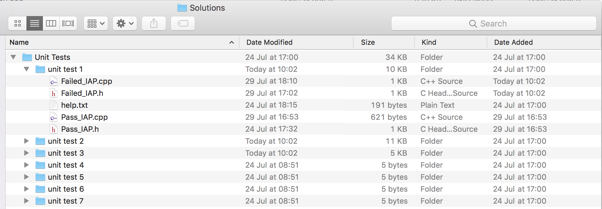

# Unit Testing

Testing code is part of good software development practice. Unit tests are usually automated checks designed to verify that a piece of code (the "unit" under test) performs a specific task exactly as designed.

Certain exercises in the tutorials are milestones along your journey learning C++. Aserve can automatically send messages to your iapProj program in xcode to see if your solution to the exercise responds in the expected way.

 Aserve will try to link `iapProj` code to the `Solutions` folder, and will automatically keep copies of code which has passed and failed. **You will be required to hand-in code for assessment. Be sure to keep backups of your `IAP-master` folder!**

This document outlines each of unit tests Aserve can perform with details of inputs and expected outcomes.

# Setup

To view the unit test panel in Aserve select it from the dropdown menu (it is hidden by default).

Once open you should see the unit test panel appear on the right hand side.

# Description

Each of the tests are listed in the scrolling menu, the coloured circle depicts the current state of each test. Red means the test failed, orange means the test is currently running and green means the test has passed. 

The first time you open Aserve, or if you have quit and restarted Aserve, these circles will be grey. Aserve will try to link `iapProj` code to the IAP `Solutions` folder, and will automatically keep copies of code which has passed and failed. **It is important to keep backups of your IAP-master folder**

To run a test, call the `aserveBeginUnitTest()` function from your iapProj program code. For example to run test number 3, you should call `aserveBeginUnitTest( 3 );`. Aserve will automatically begin running the test number provided. Helpful error messages and hints on potential problems are shown in the Aserve user interface, so be sure to check carefully.

# Saving

Once a test has been run the solution to the test will be copied from your Xcode project to the Solutions/Unit Tests folder inside your project folder. The files are prepended with *Failed* if the test fails or *Pass* if they pass. When re-opening Aserve, this folder is scanned and the interface updates accordingly, keeping track of each test. It is important that you **do not** manually edit the files in this folder. You should ensure that you keep a backup copy of each unit test that has passed inside codebook.

# The Tests

The table bellow outlines each test and the tutorial exercise they are based on. Please note that some tutorials will need adapting for the purpose of validating the unit tests.

| Number | Unit Test Name | Exercise Number | Exercise Name |
| --- | --- | --- | --- |
| 1 | Midi Note to Frequency | 3.3 | <a href="../Tutorials/Part%201/3%20-%20Processing%20MIDI%20Input.md">Our first monophonic synthesizer</a> |
| 2 | Drum Sampler | 4.4 |  <a href="../Tutorials/Part%201/4%20-%20Flow%20Control.md">Fixing the drum sampler </a> |
| 3 | Chord Machine | 5.3 | <a href="../Tutorials/Part%201/5%20-%20Functions.md">Chord Machine </a> |
| 4 | Monophonic Synth | 6.4 | <a href="../Tutorials/Part%201/6%20-%20Functions%20II.md">noteoff</a> |
| 5 | Scale Quantisation | 7.4 | <a href="../Tutorials/Part%201/7%20-%20Switch%20and%20Combinational%20Logic.md">Scale Quantisation</a> |
| 6 | High Frequency Test Loop | 8.3 | <a href="../Tutorials/Part%201/8%20-%20Loops.md"> High frequency test </a> |
| 7 | Music Sequencer | 11.3 | <a href="../Tutorials/Part%202/11%20-%20Vector.md"> Exercise 3: Building a music sequencer </a> |

# Test 1: Midi Note to Frequency
*Tests: <a href="../Tutorials/Part%201/3%20-%20Processing%20MIDI%20Input.md">Exercise 3.3</a>*

This unit test tests that you have correctly implemented the equation for converting note numbers into oscillator frequencies. The test will iteratively output MIDI note numbers from 0-127 and expect the oscillator on channel 0 to be updated accordingly. 

| # | Input From Aserve | Output expected from project |
| --- | --- | --- |
| 1 | MIDI notes from 0 - 127 | Switch on Oscillator 0 with correct frequency | 

# Test 2: Drum Sampler
*Tests: <a href="../Tutorials/Part%201/4%20-%20Flow%20Control.md">Exercise 4.4</a>*

This unit test tests that you have correctly implemented exercise 4.4. The test will simulate pushing each of the top 4 drum pads on the impulse keyboard. The sample should only be triggered when the pad is pushed down (velocity greater then 0) but not when the pad is released (velocity value is 0).

| # | Input From Aserve | Output expected from project |
| --- | --- | --- |
| 1 | Note on MIDI message with note number 67 | play sample channel 0 | 
| 2 | Note off MIDI message with note number 67 | nothing | 
| 3 | Note on MIDI message with note number 69 | play sample channel 1 | 
| 4 | Note off MIDI message with note number 69 | nothing | 
| 5 | Note on MIDI message with note number 71 | play sample channel 2 | 
| 6 | Note off MIDI message with note number 71 | nothing | 
| 7 | Note on MIDI message with note number 72 | play sample channel 3 | 
| 8 | Note off MIDI message with note number 72 | nothing | 

# Test 3: Chord Machine
*Tests: <a href="../Tutorials/Part%201/5%20-%20Functions.md">Exercise 5.3</a>*

This unit test tests that you have correctly implemented exercise 5.3. This test will simulate pushing each of the top 4 drum pads on the impulse keyboard. The first 3 pads should play major chords, and the 4th pad a minor chord. Each note of the chord must be played on a different channel at the same time. See the below table for the exact expected chords.

| # | Input From Aserve | Output expected from project |
| --- | --- | --- |
| 1 | Note on MIDI message with note number 67 | Output MIDI notes 60 64 67 (C major) as frequencies on the first 3 oscillator channels | 
| 2 | Note on MIDI message with note number 69 | Output MIDI notes 65 69 72 (F major) as frequencies on the first 3 oscillator channels | 
| 3 | Note on MIDI message with note number 71 | Output MIDI notes 67 71 74 (G major) as frequencies on the first 3 oscillator channels | 
| 4 | Note on MIDI message with note number 72 | Output MIDI notes 57 60 64 (A minor) as frequencies on the first 3 oscillator channels | 

# Test 4: Fix noteoff
*Tests: <a href="../Tutorials/Part%201/6%20-%20Functions%20II.md">Exercise 6.4</a>*

This unit test tests that you have correctly implemented the expected behaviour for note off messages for a monophonic synthesiser. The oscillator should always play note on messages when received but only switch off when the note number of a note off messages matches the frequency of the oscillator that is currently playing.

| # | Input From Aserve | Output expected from project |
| --- | --- | --- |
| 1 | Note on MIDI message a | Switch on Oscillator 0 with correct frequency and amplitude | 
| 2 | Note on MIDI message b | Update Oscillator 0 with correct frequency and amplitude | 
| 3 | Note off MIDI message a | Nothing as oscillator is playing note b |
| 4 | note off MIDI message b | Switch off Oscillator 0 as note off number matches the playing oscillator |

# Test 5: Scale Quantization
*Tests: <a href="../Tutorials/Part%201/7%20-%20Switch%20and%20Combinational%20Logic.md">Exercise 7.4</a>*

This unit test tests that you have correctly implemented the major scale quantization function. All notes should be quantised to the C major scale (white keys) this means each time a black key is pressed the corresponding note is transposed by 1 semitone (value increased by 1). The test will iteratively output MIDI note numbers from 0-127 and expect the oscillator on channel 0 to be updated accordingly. 

| # | Input From Aserve | Output expected from project |
| --- | --- | --- |
| 1 | MIDI notes from 0 - 127 | Switch on Oscillator 0 with correct frequency - all frequencies should correspond to notes in the C-major scale | 

# Test 6: High Frequency Test
*Tests: <a href="../Tutorials/Part%201/8%20-%20Loops.md">Exercise 8.3</a>*

This unit test tests that you have correctly implemented a looping high frequency test. This unit test will require you to adapt one of your solutions from exercise 8. When you run this unit test Aserve will send out a modwheel control change message. When this happens you should start an oscillator frequency sweep. 

A template for this scenario (wait for modwheel, then do something) is supplied [here](../Code%20Exercises/Tutorial%208/unit%20test)

Your frequency sweep should start with a frequency value of 20hz and increment the frequency value by 17 on each loop increment. Note that you should sleep for 10ms on each loop increment. The test should only run while the frequency value is less then 17,300 hz. 

| # | Input From Aserve | Output expected from project |
| --- | --- | --- |
| 1 | Modwheel moved | Start an oscillator at 20 hz and increment this frequency by 17 hz upto 17,300 hz. | 

# Test 7: Vector Sequencer
*Tests: <a href="../Tutorials/Part%202/11%20-%20Vector.md">Exercise 11.3</a>*

This unit test will test all of the features of exercise 11.3. Aserve will send a series of note on and note off messages to your project. Your project should store these note numbers. Aserve will simulate pushing the play button at which point you should playback all the notes sent previously. This should continue to loop until a stop message is recieved (CC 114), at this point playback should stop.

**Note that for the test you will need to stop and re-run your project between tests.**

| # | Input From Aserve | Output expected from project |
| --- | --- | --- |
| 1 | 10 MIDI messages 5 note on, 5 note off | Each note should be synthesised | 
| 2 | CC 115 with a value of 127 | The program should output the note on messages sent previously in 250ms intervals, this should repeat |
| 3 | CC 114 with a value of 127 | Playback should stop, oscillator state should be switched off |

## File paths

When your project runs it sends Aserve a message specifying the location of your project and source files. This only needs to happen once. If you close Aserve for any reason, you will need to re run your project once to set the file paths. This all happens automatically and you most likely will never see any error messages because of this. However **the unit test mechanism can fail** if the paths are not set correctly.

Aserve needs to know where it can find your IAP.h and IAP.cpp files,  so that it can correctly store your `Solutions` folder. An ` Invalid unit test ___ path ` message appears when Aserve doesn't know where your iapProj code is.  

Here's a sure fire way to ensure Aserve knows where everything is:

1. First start Aserve.
 * Then start Xcode, load the iapProj.
 * Do not tell Aserve to start a Unit Test yet.

2. Edit your Xcode iapProj to make a single call to aserveSleep() in IAP:run. The program does not need to do anything else.
 * Build, run, and wait for this simple program to complete and connect to Aserve.

3. Now reset your Xcode iapProj to use your Unit Test code.
 
You only need to follow these steps when Aserve shows the "invalid path" message.
 
On **very rare** occasions where you need to manually tell Aserve the location of your project and Solutions folder. To do this open settings -> unit test setup (from the dropdown menu). **Speak to a member of staff before changing any of the settings - normally setup should complete automatically as described above.**

# Sorting, Reversing, Shuffling
*Tests: <a href="../Tutorials/Part%202/13%20-%20Constants%20and%20Algorithms%20II.md">Exercise 13.4</a>

As a challenge, adapt and extend your solution to unit test 7. You will only need one vector, and you only need to store note-on note numbers. **Once the playback for-loop has ended you should set the playButton to be false** (so that the sequence plays once, not loop). Aserve will send various CC commands and these should perform various algorithims on the stored sequence, before playing it back.

| # | Input From Aserve | Output expected from project |
| --- | --- | --- |
| 1 | 10 MIDI messages 5 note on, 5 note off | Each note should be synthesised | 
| 2 | CC 115 with a value of 127 | The program should output the note on messages sent previously in 250ms intervals, this should not repeat |
| 3 | CC 112 with a value of 127 | All notes sent previously should be sorted into assending order |
| 4 | CC 115 with a value of 127 | The program should output the note on messages sent previously in 250ms intervals, this should not repeat |
| 5 | CC 113 with a value of 127 | All notes sent previously should be sorted into descending order |
| 6 | CC 115 with a value of 127 | The program should output the note on messages sent previously in 250ms intervals, this should not repeat |
| 7 | CC 116 with a value of 127 | All notes sent previously should be randomly shuffled |
| 8 | CC 115 with a value of 127 | The program should output the note on messages sent previously in 250ms intervals, this should not repeat |
