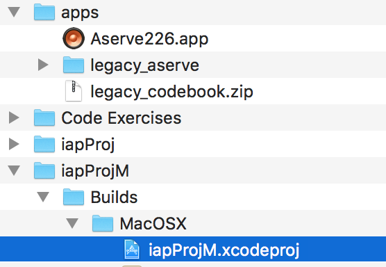
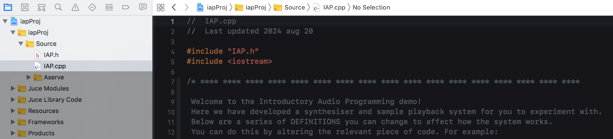

# Getting Started

Welcome to IAP (Introductory audio programming)

</img></img>

## About IAP

Programmed electronic devices are abundant in every sector of the music industry. In whichever area you choose to focus your studies - in the creation or use of audio technology - an intimate understanding of the inner workings of these devices will naturally enhance your abilities. 

Throughout this module you will learn important fundamental programming skills and concepts by writing programs that perform audio and music related tasks. 

## Weekly tasks

All IAP learning materials are provided upfront - organised so that you can work at your own pace - but we will examine topics in classes on a week by week schedule. Each tutorial introduces a new programming concept which will be explored and exercised in the C++ programming language. 

Whilst you are free to move ahead at your own pace if you wish, it is very important that all exercises are completed in the intended order as the material is incremental; that is, each practical builds upon the last. **It is very important to attend support sessions. Poor attendance often results in poor grades. The secret here to passing this module (and achieving a state of music tech bliss) is to follow the schedule week-by-week!**

## Getting the tools

### OSX Users

A video guide for setting up XCode on MacOS is here: <a href="https://www.youtube.com/watch?v=OQFYdAl54XE">MacOS setup video</a>

For those of you on OSX 10.15+ please watch this version instead: <a href="https://www.youtube.com/watch?v=OQFYdAl54XE">MacOS setup Catalina</a>

Download the IAP repository (which contains all of the required materials and applications)

::arrow_right:: [Download master branch zip file](../../../archive/refs/heads/master.zip) ::arrow_left::

You will also need to download Xcode from the appstore if you are working on your own machine. The university machines already have Xcode installed.

Apple maintain an archive of XCode versions for various MacOS versions here:

https://developer.apple.com/xcode/

Please join the Apple developer network (at no cost) here: 

http://developer.apple.com/programs/register/

### Windows

A video guide for setting up Visual Studio on Windows is here: <a href="https://www.youtube.com/watch?v=_bTzXlonKeo">Windows setup video</a>

Download the IAP repository (which contains all of the required materials and applications)

::arrow_right:: [Download windows branch zip file](../../../archive/refs/heads/windows.zip) ::arrow_left::

For windows users you will need to download Microsoft's Visual Studio:

https://visualstudio.microsoft.com/thank-you-downloading-visual-studio/?sku=Community&channel=Release&source=VSLandingPage&cid=2011

The setup video above mentions Visual studio 2017 (for compatibility) but we recommend and support Visual Studio 2019.

## Opening the IAP Project

Once you have downloaded the materials and installed either MacOS Xcode or Windows Visual Studio, the next step is to open the code project for your platform. The image below shows the folder structure. See the video guides above for more help.

Once your editor application has started:

1. Expand the project hierarchy until you can see the file `IAP.cpp`
2. **Single click** on `IAP.cpp` to open it for editing. 

If you double-click by mistake, close the separate window that will appear, and try again. Ensure your Xcode window looks the same as the screenshot below. 

## The first tutorial exercises

You can now start the practical sessions from [Tutorial 1 - Section 1 - Familiarisation](Part%201/1%20-%20Familiarisation.md).
