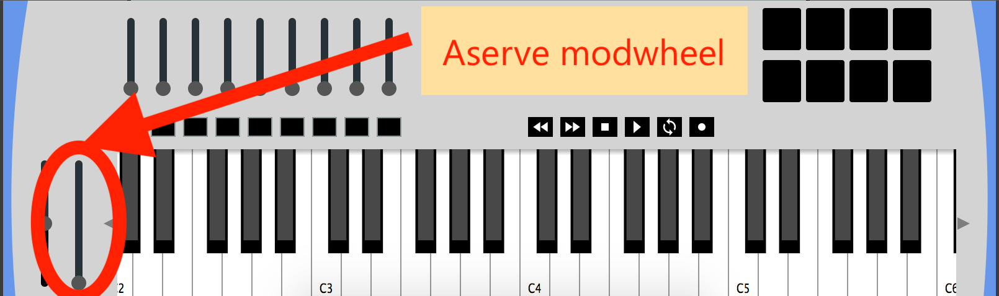

# Tutorial 3 – Processing MIDI input 

In this practical we will focus on processing MIDI input data, and building our first synthesizer. By the end of this practical you should have knowledge of:

1.	Callback functions.
2.	Aserve filters.
3.	MIDI note numbers and note frequencies.

## Callbacks

In computer program design we have two opposing principles for dealing with input. Either continuously check if something has changed (known as *polling*). Or we can set things up to alert us when something has changed (we call this second method a *callback*).  

Previously we have used **std::cin** to wait for the user to enter some text that we could then process and display. This input method is sometimes called "blocking" or "busy waiting" - because the program cannot proceed until input is complete.

In this exercise we will use a *callback* to be alerted when MIDI information is received. This is sometimes called "interrupt driven" or "event driven" input - because our program can be interrupted by an event (e.g. someone pushing a MIDI key) to react accordingly. 

Programs with event driven input do not need to execute sequentially. That is to say, each section of the code deals with different inputs (QWERTY keyboard, MIDI keyboard, mouse, audio, touch, etc) and the flow of the actual program when it is running can jump between different sections as necessary.

## Exercise 1: Adding a callback

Ensure that any work from last week is appropriately saved and that you have set your `IAP.cpp` and `IAP.h` files to the <a href="../../Code%20Exercises/Tutorial%201/">clean files provided</a>.

To add a callback to the IAPproj template, we need to make changes in **both** the IAP.h file and in the IAP.cpp file. Let's deal with the IAP.cpp file first.

1. Select the IAP.cpp file for editing
2. Add a busy-waiting loop inside IAP::run(), between the opening **{** and closing braces **}**. Your complete IAP::run() function should look like this.

```cpp
void IAP::run() 
{
	while (true) 
	{
   		aserveSleep(1000);
	}
}
```

1. Keep the IAP.cpp file selected for editing
2. Add the following block of code **under** IAP::run(), **after the last closing brace }**

```cpp
void IAP::callbackNoteReceived (int note, int velocity, int channel)
{
   	std::cout << "Note Received: " << note;
	std::cout <<  " Velocity: " << velocity << "\n";
}
```
**Make sure you type this code exactly, and that you've understood where it should be written in the IAP.cpp file.**

Now let's deal with the IAP.h file.

1. Select the IAP.h file for editing
2. Find the line ***callbackNoteRecived*** in IAP.h 
3. Remove the two // characters (single line comment) at the start

```cpp
//void callbackNoteReceived (int note, int velocity, int channel);
```
Should now look like:

```cpp
void callbackNoteReceived (int note, int velocity, int channel);
```

## Exercise 2 - Adding a callback - time to test!

Ensure that Aserve is open before running your program in Xcode.

When you push keys on either the virtual keyboard inside Aserve, or on the physical Impulse keyboard, the console window of the IAPproj program will show information about which key is being pressed.

You may wonder how our program can print values to the console if our main IAP::run() function is sleeping continuously. This is because we now have two threads going on at once. A technical definition of threads is beyond the scope of IAP - but we cover them in more detail in later years.

Part of our program is dealing with incoming MIDI, and the other part (our run function and loop) is free to do other things. This is called 'event driven programming' because different parts of the program respond to different events (such as incoming MIDI). This is a very common design for interactive systems in audio, such as hardware or software synthesisers, digital audio workstations, etc.

## Exercise 2: Making a noise

If we want to make sound in response to pressing keys, we can try to extend our callback to call `aserveOscillator()` as shown below. The eagle-eyed readers will notice that there is **something subtlely wrong**... but it's a good first attempt.

```cpp
void IAP::callbackNoteReceived (int note, int velocity, int channel)
{
   	std::cout << "Note Received: " << note;
	std::cout <<  " Velocity: " << velocity << "\n";

    aserveOscillator( 0, note, 0.5, 0 ); // sine wave
}
```

Remember to add the oscillator code underneath the existing **std::cout** statements.

## Exercise 3: A frequency calculation

Music, much like many other fields, involves some mathematical principles. One of these is the formula for converting MIDI note numbers into frequencies. 

Our program above is **subtlely wrong** because it does not perform any conversion. Since MIDI note numbers have a range of 0..127 the sounds produced by the program above are very low bass only.

We can calculate note frequencies using the formula shown below:


where 'n' is the note number we are interested in, and 'f' is the calculated frequency. You will need to use the power function to calculate the exponent (the part written above the number '2'). 

The pow() function takes two arguments x and y and returns the result of x to the power y. 
That is, the equation: 


can be written in C++ as: 

```cpp
p = pow (x, y);
```

## DEBUG exercise: Our first deliberately broken synth

Complete this debug exercise by **uncommenting and rearranging** the deliberately jumbled code in the section below. 

The idea here is to make your callbackNoteReceived calculate the frequency for aserve's ocscillators to use whenever a note is received.

```cpp
void IAP::callbackNoteReceived (int note, int velocity, int channel)
{
   	std::cout << "Note Received: " << note;
	std::cout <<  " Velocity: " << velocity << "\n";

   //  THE FOLLOWING LINES ARE DELIBERATELY IN THE WRONG ORDER
   //
   //	int freq = 440 * power;
   //	aserveOscillator (0, freq, 0.5, 1); // squarewave oscillator
   //	int power = pow(2, octave); 
   //	int octave = (note – 69) / 12.0;
   //
   //  THE ABOVE LINES ARE DELIBERATELY IN THE WRONG ORDER
}
```

As you uncomment and rearrange the code, your editor **may** show useful code hints and suggestions, but may also show hints and suggestions which jumble the solution even further. If you get stuck or lost, don't be afraid to ask staff for help. 👍

When you run and use your program to confirm that it works correctly, you should be able to press a key and hear a sound from the speakers that is much more appropriately tuned...

...you *may* notice some weird behaviour to the program. Read on below.

## DEBUG Exercise: Just one more thing...

You should notice that no matter what physical key we push, we hear the sound of an A in different octaves.

The reason that the program does not work correctly is due to using integers. Since note frequencies have decimal parts, we will need to replace some of the *int* datatypes with *float* datatypes.

```cpp
	int freq = 440 * pow( 2, (note-69)/12); // INTEGER frequency
```

Becomes

```cpp
	float freq = 440 * pow( 2, (note-69)/12.0); // correctly calculate FLOAT frequency
```

Note that the 'divide by 12' statement must be 'divide by 12.0'. An integer value `12` is not the same as a floating point `12.0`. We must ensure we use floating point datatypes everywhere to precicely calculate all of the fractional values. Try applying all of the required fixes and witness the result.

## Exercise 4: Filter Control

Lets now have a go at using a second callback function, this time for the modulation wheel (circled below). We will adapt this to control the Aserve built-in low pass filter:




Firstly in our IAP.h file we need to un-comment the callback function for modwheel events:

Before it looks like:
```cpp
    //void callbackModWheelMoved (int value);
```

And now it should look like:

```cpp
    void callbackModWheelMoved (int value);
```

Return to the  IAP.cpp and add the following code **under the IAP::run() function** as you did above for the note callback. Your IAP.cpp should look something like this:

```cpp
IAP::run() 
{
	while (true) 
	{
   		aserveSleep(1000);
	}
}

void IAP::callbackModWheelMoved (int value)
{
	std::cout << "Modwheel just moved - the value is " << value << "\n";
}
```

For this exercise, we want the modwheel to control the cutoff frequency of the built-in Aserve low pass filter. This will muffle and un-muffle the sound as we move the modwheel. The cutoff frequency has a range from 20Hz to 20,000Hz... but our modwheel has a different range.

1. Run the program.
2. Move the modwheel to the lowest and highest position.
3. Watch the console output and write down the maximum value of the mod wheel value.
4. Use the formula below to scale and shift the value.


```cpp

void IAP::callbackModWheelMoved (int value)
{
	std::cout << "Modwheel just moved - the value is " << value << "\n";

	float cutoff = ((value / [insert maximum value here and remove square brackets].0) * 19800) + 20;
	aserveLPF(cutoff);	
}

```

All being well, you now have a working monophonic synth with a simple filter control assigned to the modwheel. If you can’t hear the muffling effect taking place, try checking the wave type of your `aserveOscillator()`, a square (wave type 1) waveform will allow you to easily hear the effect.

## Challenge Exercise: Better Filter Control

To improve the range of controls for the filter you may use the following formula:


```cpp
cutoff = ( pow((value / [insert maximum value here and remove square brackets].0), 3.0) * 19800) + 20;
```

This will apply a non-linear scale to the filter control to gives us a more natural sounding filter sweep. You may also wish to adjust the constants 19800 and 20 and observe what effect this has.

## Conclusion
Ensure that you understand how to use callback functions before next weeks practical, as they will be used in every practical in future. 

## Important Material

Knowledge of the following will be assumed in next week’s practical:

1. How to use callback functions
2. How to convert note numbers to frequency values
3. The use of the pow function


## Videos

The following videos may help you during this session:

### Aserve Programming 2 - callbacks

[](http://www.youtube.com/watch?v=ZJXi2eIq--0)

### Operators

[](http://www.youtube.com/watch?v=yPNMVlxy1B0)


