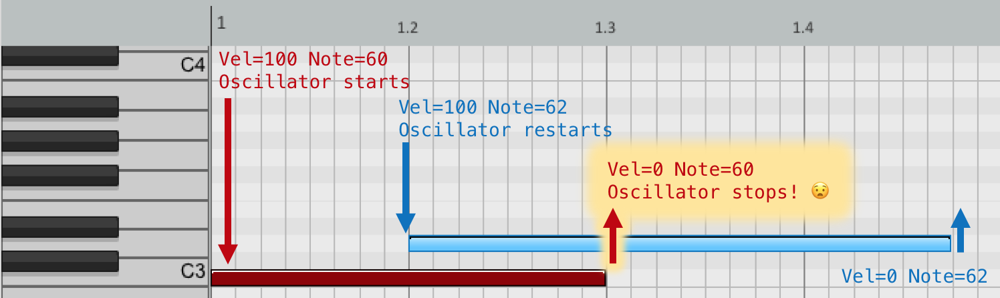

# Tutorial 6 - Functions II

Functions continue to be one of the most important concepts in building larger programs. In this practical we will focus on how to share variables between functions effectively. On successful completion of this practical you will have an understanding of:

1.	Variable scope
2.	When and how to declare shared variables
3.	Using shared variables to store 'previous values'

## Getting started

This week we'll explore sharing values between blocks of code in the IAP project, including several common design problems and solutions that relate to this.

## Exercise 1: Variable scope

Add the following code to your `IAP.cpp` (below the run function) replacing the existing note callback function. 
Remember to uncomment the relevant callback declarations in your `IAP.h` file.

```cpp
void IAP::callbackModWheelMoved (int value)
{
  int wave = 0;         // used for our oscillator when notes are pressed
  if( value >= 64 )     // if the modwheel is over halfway
  {
    wave = 1;           // we want to hear a square wave
  }
  else 
  {
    wave = 0;           // otherwise we want to hear a sine wave
  }
}
```

```cpp
void IAP::callbackNoteReceived  (int note, int velocity, int channel)
{
  int wave = 0;         // used for our oscillator when notes are pressed
  if( velocity > 0 )    // if the note received is 'pressed'
  {
    float frequency = mtof(note);              // calculate frequency
    aserveOscillator(0, frequency, 1.0, wave); // and start the oscillator playing with desired wave
  }
  else
  {
    aserveOscillator(0, 0, 0, 0);              // otherwise, silence please!
  }
}
```

This code is designed to switch between a sine wave and a square wave depending on the position of the modwheel. Run the program and check that this works correctly. You should notice a deliberate flaw.

# Error
If we look closely at our program, we can see that two variables share the same name `wave` but they are not truly shared. This is a very common design problem. We wanted you to experience both the problem, and the simple solution below. 😊

## Exercise 2: Shared variables

To fix this issue we simply need to add a **shared variable** to our IAP.h file. Shared variables are variables that can be accessed between functions. Shared variables also retain their value while the program continues to run. Navigate to our IAP.h file and add a variable called **wave** of type **int**. Place this under the SHARED VARIABLES label.

```cpp
//-------------------------------------------------------------
// SHARED VARIABLES
int wave = 0;
```

Go back to our `IAP.cpp` file and **delete both of the duplicated, non-shared `int wave` variables**. Your functions should now use the single, shared, variable named `wave` declared in the appropriate way.


Re-run your program and check to ensure that the modwheel behaviour working correctly. When the modwheel is over half-way, notes should play back with a square-wave, otherwise we hear a sine tone.

## Exercise 4: Fix noteoff - We have a problem!

Shared variables are also useful for solving another common design problem: *storing and comparing 'previous values' of variables*.

For a number of weeks, you will have encountered a bug with the monophonic synths that we have been building. 

If you press and hold a note with your left hand and then a second note with your right hand, you will notice that the oscillator is stolen by the most recently pressed note - the right hand note. 

The problem is that the oscillator stops no matter which note we release. Our code does not 'care' which note is released. We need to fix that.

The ideal behaviour is that the oscillator should stop *only when releasing the 'previously pushed' note*.

In case it helps to visualise, below is an annotated screenshot of a pianoroll showing the events descried in the paragraph above.



## Exercise 4: Fix noteoff - A possible solution

We can fix this by *adding a shared variable* to remember the 'previous note' number pressed.

We will need to *modify our if statement* inside the callbackNoteReceived(), such that the shared variable is checked to see if it matches the note number of the ‘note off’ message. 

## Some starting point code

Look at the starting point code below. Remember that the problem is that our code stops the oscillator no matter which note we release. The ideal behaviour is that the oscillator should stop *only when releasing the 'previously pushed' note*.

```cpp
void  IAP::callbackNoteReceived  (int note, int velocity, int channel)
{
    if( velocity > 0 )                              // did we 'press' a note?
    {
        float frequency = mtof(note);               // calculate frequency
        aserveOscillator(0, frequency, 1.0, wave);  // start oscillator sound
        currentNote = note;                         // remember this note number (in a shared variable)
    }
    else if( velocity == 0 )                        // did we 'release' a note?
    {
        aserveOscillator(0, 0, 0, 0);
    }
}
```

This code is deliberately incomplete. Can you work out what we need to do to complete the puzzle and fix the note off problem?

### Some hints

A shared variable in the `IAP.h` file can store the 'previous note' number.
Store the pressed note number in the shared variable when we switch on the oscillator.
Don't just compare the velocity to find 'released' notes... Also compare the 'previous note' shared variable before you switch the oscillator off.

## Debug Exercise

For each of these functions give a single reason for why each one is incorrect. If you are unsure have a look back at examples from last weeks practical. 

**You can assume that the functions have been declared correctly inside IAP.h**

### 1:
```cpp
void IAP::getFrequencyValue ()
{
    float freq;
    std::cout << "Please enter a frequency";
    std::cin >> freq;
    return freq;
}
```

### 2:
```cpp
void IAP::calculateSum (int a, int b);
{
    int result = a+b + a*b;
    std::cout << "Result: " << result << "\n";
}
```

### 3:
```cpp
void IAP::playNote (float frequency, float amplitude)
{
    aserveOscillator(0, frequency, amp, 0);
}
```

### 4:
```cpp
float IAP::tuneNote (float frequency)

    frequency = frequency * 1.5123;
    return frequency;
}
```
*The most common programming mistakes, are: missing brackets, missing braces, spelling errors, and semi-colons where they are not supposed to be.*

## Important Material

Understanding of the following will be assumed in next weeks practical: 

1. When to place variables inside the IAP.h file
2. How to share data between functions
3. Variable scope


