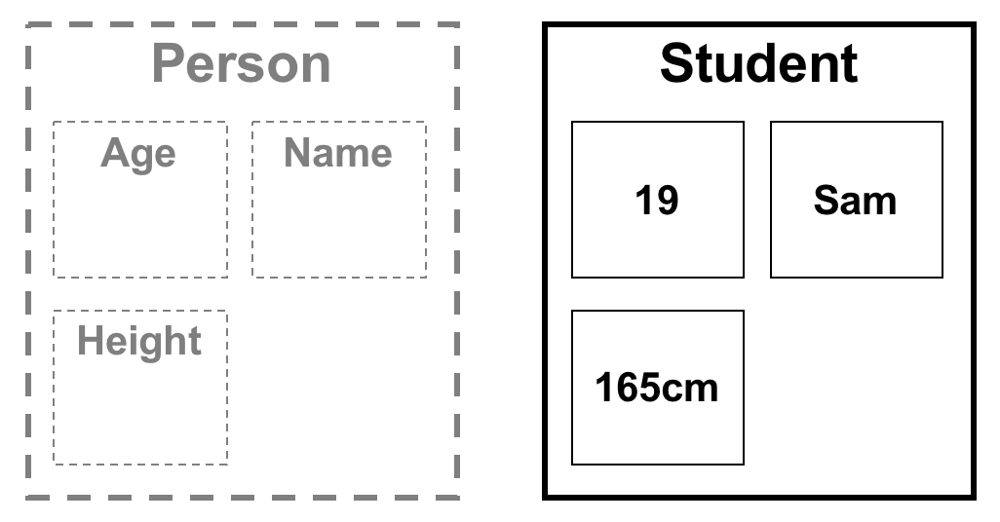
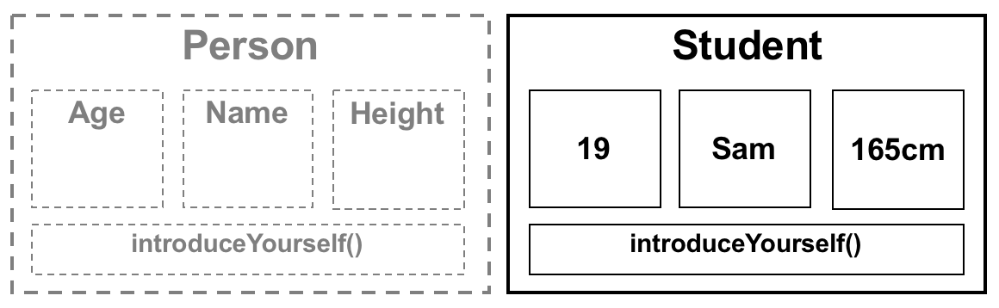

# Tutorial 9 – Classes

In this practical you will learn about objects and classes. On successful completion of this practical you will have an understanding of: 

1. The basics of defining a class
2. Class member variables
3. Class methods (also known as functions)

## Class

In the real world we are used to seeing, discussing, and using objects. For example, your phone is one of many phones in the world. However, it shares a number of characteristics and features with all other phones, for example making calls. We can think of a generic phone as a **class of object** and your specific phone as the **instance of one.** 

Using object oriented terminology, we might say  a very primitive mobile phone **class** stores **data** like contacts and has **methods** for acting on the data, i.e. call a contact, add contact, delete contact.

## Person

Person

To illustrate further let’s think about a generic person. A generic person has a number of features that describe that person (you can think of these as variables). To use this in a C++ context we must also specify the data type. A table of features has been partially pre-populated below, **please add 3 more features.**

| **Feature** |	**C++ data type** |
| --- | --- |
| Height | float |
| Age |	int |
| Name | std::string |

## Exercise 1: Person Class

To help conceptualize the topics we have discussed so far you will now create your own **person** class. 

Firstly, navigate to your IAP.h file and add the following **under** the `#include ...` and **above** the `class IAP ...`  

```cpp
//...
#include "AserveComs.h"

//---------------------------------------------------------------------------------
class Person {
public:
    std::string name;
};
//---------------------------------------------------------------------------------

class IAP : public AserveComs  {
//...
```
You might like to think of our 'person' class as a blueprint for a generic person, the class describes the kind of information a person might know about themselves, whilst each 'instance' we create is a different person with different information.



## Syntax

The **class** keyword in C++ is used when we want to define a class, following from this keyword is the name (**Person**) of the class. By convention class names should always start with a capital letter.

The **public** keyword is used to define parts of our class that are visible to other parts of the program. We'll expand on the concept later in the practical.

A **brace** should always follow the class name, and the class definition ends with a closing **brace and semicolon**.

A **property** (like our `Person`s name) 'belong' to the class, and can be said to be **members** or **member variables** of the class.

## Instance

Lower down in the IAP.h file... let's create an **instance** of our person, add the following line of code to our shared variables label in our IAP class. *note that shared variables are actually member variables of our IAP class.

```cpp
  //---------------------------------------------------------------------------------
  // SHARED VARIABLES (IAP member variables)
  Person student; // we have added a person type
```

Finally lets use member variables.

## The dot syntax 

In the IAP.cpp file, edit your IAP::run() function to set and access our member variables of our shared `Person`. We can simply use the dot operator. For example, below we set the **name** inside the student **instance** to “sam”.

```cpp
void IAP::run()
{
    student.name = "Sam";
    std::cout << "Person’s name is: " << student.name;
}
```

To complete this exercise set all of the member variables in your student instance inside the IAP::run() function. Make sure you set and print all of the values to ensure this has worked correctly. Set and print the age, height, etc...

## Exercise 2: Class methods

When we add a second `Person` instance, for example a lecturer, we begin to add unnecessary code duplication (your solution to exercise 1 above will look much more messy and inelegant than below). Repeated blocks of code printing different contents of different person class instances. 

```cpp

void IAP::run ()
{
    student.name = "Sam";
    student.age  = 19;
    
    lecturer.name = "Phil";
    lecture.age   = 103;
    //set all other member variables
    
    std::cout << "Person's name is: " << student.name;
    std::cout << " and their age is: " << student.age;
    
    std::cout << "Person's name is: " << lecturer.name;
    std::cout << " and their age is: " << lecturer.age;
    
    //print all other member variables
}
```

This can be **much more elegant and concice** if we use a **method** as part of our **person class** called **introduceYourself()** acting directly on the data.

## Class methods

Class methods are functions that live inside a class definition and normally act upon the state of the class in someway. A class method has access to all of a classes member variables, **without needing to use the dot operator.** 

To add a class method simply define a function within the class’s definition, underneath the public label, and before the ending brace. The function should be called **introduceYourself** and takes no arguments nor returns any value. In other words, a 'void' function.

Back in the IAP.h file, find your Person class definition and edit it to look like this below...

```cpp
class Person {
public:
    std::string name;
    int         age; 
    
    // class method definition and declaration
    void introduceYourself ()
    {
        std::cout << "Hi, my name is " << name;
        std::cout << " and my age is " << age;
    }
};
```



You might like to think of any person we create from our blueprint having the "skill" or "ability" to introduce themselves. We can complete the exercise by removing the repetitive print code from your IAP::run() back in the IAP.cpp file, replacing with a single call to each person’s **introduceYourself** method. 

Make sure our person blueprint introduces all of their properties: age, height, name, and any other property you have added as part of their introduction.

*Note that both student and lecturer should introduce themselves.* 

```cpp
    student.introduceYourself();
    lecturer.introduceYourself();
```
Compare your code from before and after refactoring to see how much cleaner, more elgant, and more concice this technique is!

## Exercise 4. Making a Synth class

This stuff about `Person` is just practice. Now we will explore musical benefits of defining our own classes. 

Please download the [supplied starting point code](../../Code%20Exercises/Tutorial%209/Exercise%204), copy and paste the contents of both IAP.h and IAP.cpp into your project.

Add the following methods to our IAPSynth class.

1.	A **method** called playNote that takes two arguments, note and velocity but does not return anything.
2.	A **method** called stopNote that takes a single argument called note but does not return anything.
3.	A **method** called setWavetype that takes a single argument called waveType that does not return anything.
4.	A **method** called mtof that takes a single argument called note and returns a frequency.

Add the following member variables to our IAPSynth class.

1.	A member variable called lastNote
2.	A member variable called currentWavetype

A brief description of what each function does is given below, you should have completed code previously that you can use for the majority of this exercise.

### playNote

Should calculate the frequency and amplitude from the supplied input arguments. It should turn an oscillator on and also store the note number into lastNote member variable.

### stopNote

Stop note should check the supplied note number against the lastNote member variable, and only switch the oscillator off if it matches.

### setWavetype

This function should simply copy the input argument and set the currentWavetype member variable.

Once you have completed the above you should make an instance of your IAPSynth class in the `SHARED VARIABLES` section of your IAP class:

```cpp
class IAP : public AserveComs  {
public:
    // SHARED VARIABLES
    IAPSynth synth;
```

You can then replace the comments inside the starting point callback functions to call your `synth` member functions. For example:

```cpp
void IAP::callbackNoteReceived  (int note, int velocity, int channel)
{
    if (velocity > 0) {
        /* play note */
        synth.playNote( note );
    }
```


## Why use classes at all?

It would perhaps seem like more work to offload our code for turning oscillators on/off into a separate a class than simply doing it inside the callback functions. However, there are several good reasons for doing this. Firstly, all our relevant code for synthesis is now grouped in one place, meaning that our IAP class is less cluttered and more concise. Secondly we can add features to our synthesizer class without affecting our current code. Finally, we can now easily change the mapping between features of our synth (i.e. setting wavetype) and the control input (callbacks from Aserve).


## Public vs Private

Instead of calling setWaveType from the CC callback use the dot operator to set the synth’s member variable currentWaveType directly. Check that your program works correctly as it did before.

As your program works exactly the same without the need for the currentWaveType function you may wonder what the point of having the member function is. Firstly, add the the **private:** label to your IAPSynth class at the end of the declaration before the ending brace. Move the currentWaveType variable deceleration to be underneath the **private:** label. Once you rebuild and compile your program, you will now get an error as you cannot access the class’s **private** member variables. Instead you will now have to use the setWaveType member function again.

To finish our setWaveType function you should an if statement that will only set the currentWaveType variable if the value supplied is in range. Please refer to the lecture slides for more information on public/private.


## Challenge exercise

We can now easily add some more functionality to our synthesiser class. An example is given below, however feel free to create your own also. You may wish to use features development from the previous assignment.


### Volume Control
Create a class method called setVolume that takes the value of a control change message (0 – 127). Inside the function scale this value into the range 0 – 1.0 and set a member variable called **volume**. Before turning on the oscillator multiply **volume by amplitude.**

## Important note

We will be building upon and making use of the IAPSynth in all of the future practical’s this term. Please ensure that you complete this practical and if unsure ask one of the tutors to check your work.


