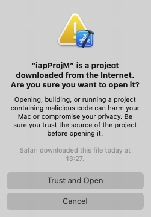

# Workshop 1 – Playful and creative exploration

Welcome to IAP (Introductory audio programming)

</img></img>

This workshop will introduce the tools used on the module in a creative and playful way. The idea is to familiarise you with the lab machines, and how we will use the hardware and software on the Introductory Audio Programming module. By the end of this session you should be familiar with: 

1.	The Apple workstations in the faculty labs. 
2.	The Xcode development environment.
3.	The Aserve application and some of its features. 

## About IAP

Programmed electronic devices are abundant in every sector of the music industry. In whichever area you choose to focus your studies - in the creation or use of audio technology - an intimate understanding of the inner workings of these devices will naturally enhance your abilities.

Throughout this module you will learn important fundamental programming skills and concepts by writing programs that perform audio and music related tasks. 

## Weekly tasks

All IAP learning materials are provided upfront - organised so that you can work at your own pace - but we will examine topics in classes on a week by week schedule. Each tutorial introduces a new programming concept which will be explored and exercised in the C++ programming language. 

Whilst you are free to move ahead at your own pace if you wish, it is very important that all exercises are completed in the intended order as the material is incremental; that is, each practical builds upon the last. **It is very important to attend support sessions. Poor attendance often results in poor grades. The secret here to passing this module (and achieving a state of music tech bliss) is to follow the schedule week-by-week!**

## Getting the tools

Download the IAP repository (which contains all of the required materials and applications)

::arrow_right:: [Download master branch zip file](../../../archive/refs/heads/master.zip) ::arrow_left::

You will need to download Xcode from the appstore if you are working on your own machine. **University lab machines already have Xcode installed and are ready for roll fr playful exploration of introductory programming for audio** 😊👍

## Opening the IAP Project

Once you have downloaded the materials, the next step is to open the code project. The image below shows the general folder structure.

1. Head to the iapProj-M folder (the IAP project for Apple M-series CPUs)
2. Expand the folder structure until you can see the Builds > MacOSX > iapProj.xcodeproj file

Double click this to open the Xcode application.

You may need to click thru to accept and close various warnings and welcoming information screens and messages shown below.

After the editor application has loaded the iapProj project 

1. Expand the project hierarchy until you can see the file `IAP.cpp`
4. **Single click** on `IAP.cpp` to open it for viewing

If you double-click by mistake, close the separate window that will appear, and try again. Ensure your Xcode window looks the same as the screenshot below. 

