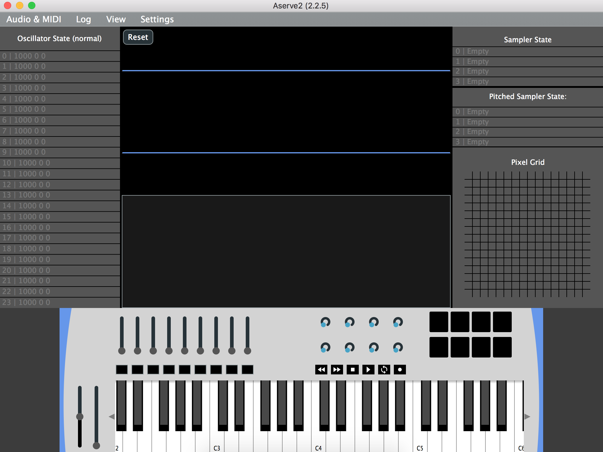
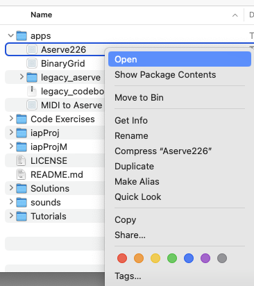
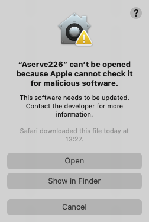
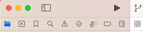
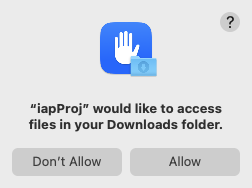
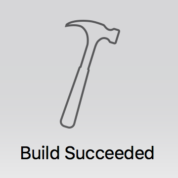

# Workshop 1 – Playful and creative exploration

Welcome to IAP (Introductory audio programming)

</img></img>

This workshop will introduce the tools used on the module in a creative and playful way. The idea is to familiarise you with the lab machines, and how we will use the hardware and software on the Introductory Audio Programming module. 

## Getting started

Your **first task** is to download the IAP repository (which contains all of the required materials and applications for the module)

::➡️:: [Download master branch zip file](../../../archive/refs/heads/master.zip) ::⬅️::

Staff can help you set up your own machine for working off-campus, but for now, let's use the lab machines. **University lab machines already have almost everything installed and ready to roll** 😊👍 

## Aserve and the IAP project working together

Once you have downloaded the repository, the next step is to open the Aserve application which looks like the screenshot below.

</img>

1. Navigate to the apps folder of the IAP materials that you have downloaded and
2. Open the `Aserve226` application **by right-clicking and choosing the `OPEN` menu option**
3. You may see security warnings (shown below)
   a. please accept the security warnings to open the application

</img>
</img>

If successful, the Aserve application window will open, but you'll quickly notice that there is no sound (nor much of a response at all!) when you move controls, dials, sliders, or press keys. 

</img>

The aserve application works in tandem with the iapProj materials provided, and on this module we will teach you how to design and write programs that control how Aserve makes sound in response to your controls. 😀

Code that you write on the module will act as a "decision maker". When you move controls and press keys, code will tell Aserve to generate sound.

## Opening the IAP Project

For this session, we'll use ready-made code. We'll explore it more deeply in later sessions, but for now we'll use it to demonstrate some Aserve features and to explore some of the creative potential. 

The next step is to open the "iapProj" in the Apple Xcode editor software.

</img>

1. Look for the iapProj-M folder (the IAP project for Apple M-series CPUs)
2. Expand the folder structure until you can see the Builds > MacOSX > iapProj.xcodeproj file
3. Double click this to open the Xcode editor application automatically load in our project

You may need to accept and close various warnings and welcoming information screens and messages shown below.

</img></img>

After the Xcode editor application has loaded

1. Click the run button (▶️) shown in the upper left of the Xcode interface
2. You may see additional security messages which you should accept to proceed

</img>

After a short wait, a success message should appear.

## Is this thing on?

Now that our "iapProj" program is running, Aserve will make sound. Return to the Aserve application. If you've accidentally closed it don't worry, just re-open it. 😊

If everything has gone to plan, Aserve will already be playing a simple drum pattern, and you can play the on-screen keys to make pitched sounds.
You should also be able to use the physical hardware controller keyboard to trigger and control the sound.

## Some suggestions for creative exploration

The xcode editor should look similar to the screenshot below

Use the panel on the left to select the `iapProj` > `Source` > `IAP.cpp` file for editing.

Scroll to reveal and read the explanatory text in the `IAP.cpp` file. The most important aspects to note are

1. The behaviour of the program can be altered by editing
2. We have prepared simple `#define` definitions for creative exploration
3. You may break the program, but it's easy to undo with `CMD+Z` to restore a working state.
   * Actually we encourage you to hack and break our code - it's a **great** way to test limits and gain experience!

There are plenty of things you can try. Feel free to explore these in any order.

Remember you can edit without "building" code. To test and run your edited code in the "iapProj" program, use the xcode run button (▶️).

1. -
2. -
3. -
4. -
5. -
6. -
7. -

### A challenge?

* Why not try

## Wrapping up - preparing for next week

Now that we're at the end of this session you should be familiar with: 

1.	The Apple workstations in the faculty labs. 
2.	The Xcode development environment.
3.	The Aserve application and some of its features.

### A little more about the module

Throughout this module you will learn important fundamental programming skills and concepts by writing programs that perform audio and music related tasks. 

All IAP learning materials are provided upfront - organised so that you can work at your own pace - but we will examine topics in classes on a week by week schedule. Each tutorial introduces a new programming concept which will be explored and exercised in the C++ programming language. 

Programmed electronic devices are abundant in every sector of the music industry. In whichever area you choose to focus your studies - in the creation or use of audio technology - an intimate understanding of the inner workings of these devices will naturally enhance your abilities.

See you next week!
