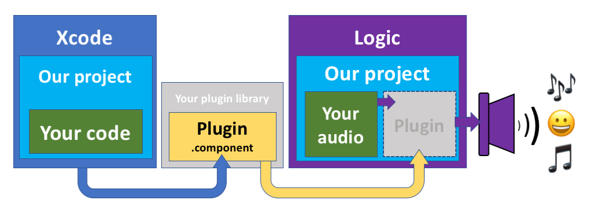
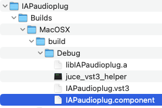
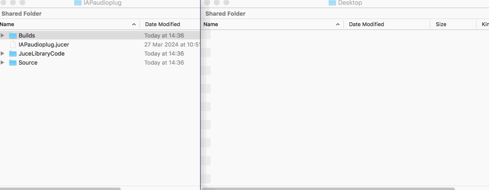
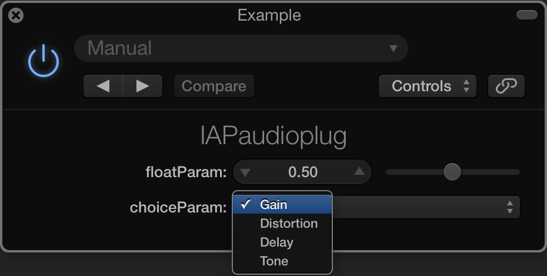
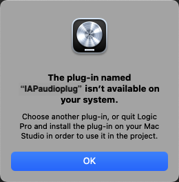
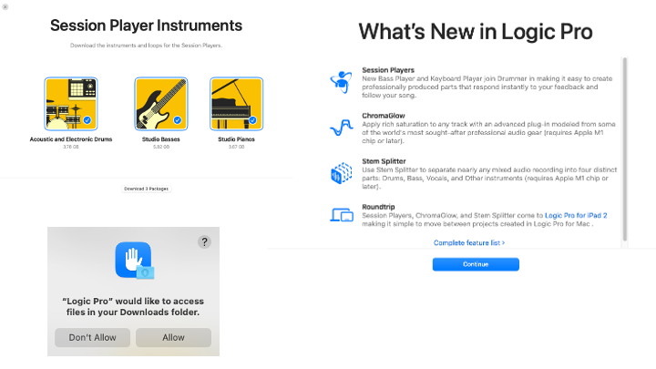
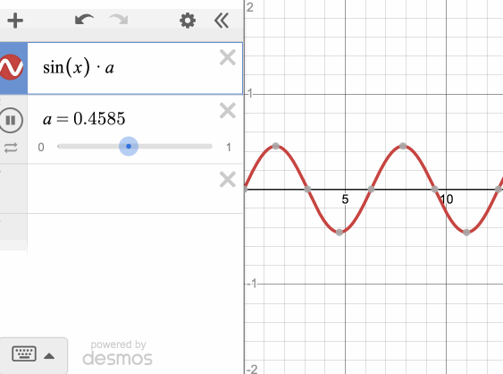

# Workshop 3 – Audio processing

This workshop will introduce audio effect processing. The idea is to record your own audio and/or use the supplied recordings for creative and playful exploration. By the end of this session you should be familiar with: 

1.	Using audio effect plugins as 'insert' effects
2.	Basic signal processing code for gain, panning, distortion, and more
3.	Building and installing audio plugin .components

Some familiarity with Digital Audio Workstations (DAWs) and how audio effects are used on audio tracks/channels is assumed. Step by step instructions are provided, so even if you're not totally familiar with these concepts yet, you can still have fun in this workshop. 😊

## Overview of the puzzle pieces

 

*(reading the diagram from left to right)*

Today we'll use Xcode to build the `IAPAudioPlug` audio plugin `.component`...

...then we'll use **Logic** as a DAW to...

...load the `IAPaudioplug` as an insert effect to...

...process your audio with an audio effect that **you have designed**... 👍

## Getting started

We provide <a href="https://uweacuk-my.sharepoint.com/:f:/g/personal/philip3_phelps_uwe_ac_uk/Er9MXyKHo2RLpB9N4FxHyjIBwhTzppLO53klFREwRFqjkQ?e=fiEKky"> starting point files </a> compatible with the MacOS software on lab machines. All files are zipped for convenient distribution.

::: ➡️ ::: First download the `IAPAudioPlug.zip` <a href="https://uweacuk-my.sharepoint.com/:f:/g/personal/philip3_phelps_uwe_ac_uk/Er9MXyKHo2RLpB9N4FxHyjIBwhTzppLO53klFREwRFqjkQ?e=fiEKky"> workshop starting point files </a>::: ⬅️ :::

The supplied xcode project and code will allow you to experiment with code for simple audio effect processing such as:
* Gain 💪
* Panning 🍳
* Distortion 🎸
* Delay ⏰⏳
* Amplitude Ring Modulation 💍 
* Tremolo 👋 ~ ~ ~
* ...and more (if you desire!)!

## Exercise 1 - Build

1. Unzip the `IAPAudioPlug.zip`, navigate to the folder `builds > MacOSX` and load the `IAPAudioPlug.xcodeproj` with xcode.
2. Use the menu to select `Product > Scheme > IAPAudioPlug-ALL`

   * icons for various schemes are different. The desired scheme icon is a dart-board target icon like this 🎯

   * for the curious: different schemes configure different types of plugin technology
   
3. Build the project – await success 🤞

4. Examine the files within the `IAPAudioPlug > builds > MacOSX` folder

   * there should now be a `build -> Debug` folder containing a variety of files

   * focus your attention on the `IAPAudioPlug.component` - confirm the date modified matches **todays date and time**

## Exercise 2 - Install

On MacOS there are several places one may install an audio plugin component. The most convenient is within your personal 'home' Library folder.
We need to install the `IAPAudioPlug.component` into this 'home' library folder.

1. Use use the finder menu `Go > Go to Folder...`
2. Search for `~/Library/Audio/Plug-ins/Components`

   a. Be **absolutely sure to use the `~` symbol in the search path here** indicating you wish to access your personal 'home' Library folder
   
   b. Ask a member of staff if you need assistance

3. Copy your `IAPAudioPlug.component` into your personal 'home' Library of audio plugin components.

## The above steps as an animation

The animation below shows the required steps.

However you choose to do it, install the .component to *your personal 'home' plugin library*. You may use `copy` and `paste` menus or drag files using the mouse. 

Later, as we improve and change our plugin, we'll replace old builds with new versions. The end of the animation shows how to confirm you want to replace an old plugin .component with a new version.

## Exercise 3 - Creative exploration!

Congratulations on getting this far. 😀🎉 **The boring parts are over, now begins the fun!**

::: ➡️ ::: Download the `Logic_DAW_Project.zip` <a href="https://uweacuk-my.sharepoint.com/:f:/g/personal/philip3_phelps_uwe_ac_uk/Er9MXyKHo2RLpB9N4FxHyjIBwhTzppLO53klFREwRFqjkQ?e=fiEKky"> starting point </a>  and open the project ::: ⬅️ :::

If everything has gone well, you will see the IAPaudioplug controls, similar to the screenshot below.

Voila! Plugin do the things. Happy fun time exploration yay! 🎶😊🎵

Logic may warn you of a required, missing component if you accidentally open the supplied Logic DAW project before your plugin is ready. If this happens, check the build and install exercise steps above and/or ask a member of staff for assistance. 

 

Logic will likely display 'session' and 'whats new' messages, **please close these to continue**. You will also need to grant security access to the project file you have opened. Screenshots are shown below.

 

# Creative prompts

* Play with the plugin to hear what it does to the sound on the timeline
   
   * ...use the provided audio timeline, or delete this and record your own sound with the microphone

   * ...use 'monitoring' mode to hear the effect applied to live microphone input **if you choose this, use headphones to avoid feedback**

* Set the plugin `choiceParam` to different settings to hear the results. 

   * All choices do something different, and there is room for *creative opportunities* and improvements that you can decide below 😊

* Read our helpful code comments provided in the xcode project

   * Focus your attention on the comments in the `PluginProcessor.cpp` file

* Read the guidance in the sections below for further inspiration and guidance

## Gain 💪

In this mode, the starting point code adjusts gain (turns up and down the volume). 

Similarly to the animation below, the `floatParam` value is used as a multiplier. The amplitude of the music 
 is scaled (right the way down to silence if the value is zero) according to the `floatParam` slider value.

Here are some questions to ask yourself:

1. Which part of `PluginProcessor.cpp` does the audio processing code appear?

2. Which part of the code runs when the `choiceParam` is set to `GAIN`?

3. Can you modify the line which says `*channelLeft *= stereoGain;`
   
   * ...to say `*channelLeft *= stereoGain * 2;` instead?
  
   * Remember that there are **two signals**, one for the left channel, one for the right.
     
   * Remember to rebuild the component and reload the logic project to test your changes 👍

## Stereo panning 🍳

4. Find and **uncomment** the code for a stereo panner effect.

   * When you rebuild and test the plugin, this **should** be stereo panner **BUT ITS NOT**. Can you figure out why? 
   
   * Hint: Why is it not possible hear a stereo-pan for a silent signal?

## Distortion 🎸

In this mode, the starting point code distorts the sound according to the slider `floatParam` value.

1. Which part of `PluginProcessor.cpp` is the distortion processing code?

2. The distortion is **deliberately weak**; how to make it stronger? 

3. What happens to the sound when you comment out one of the `if` statements? Can you hear the difference?

   * Remember to rebuild the component and reload the logic project to test your changes 👍

## Delay ⏰⏳

In this mode, the sound is echoed. We hear a delayed copy of the sound mixed with the original.

Questions to ask yourself, and things to try here:

1. Which part of `PluginProcessor.cpp` is the delay processing code?

2. What happens when you uncomment the code which performs a "feedback delay" - can you hear the difference?

3. Can you work out how to adjust the timing of the delay?

   * Remember to rebuild the component and reload the logic project to test your changes 👍

## Tone

In this mode, an oscillator signal is produced.

We can use this to perform a variety of sound mangling techniques including Amplitude Ring Modulation 💍 and Tremolo 👋 ~ ~ ~

* Tone gen modify`+=` symbols to `*=` for tone vs ring modulation

* Tone gen modify oscillator frequency for tremolo
