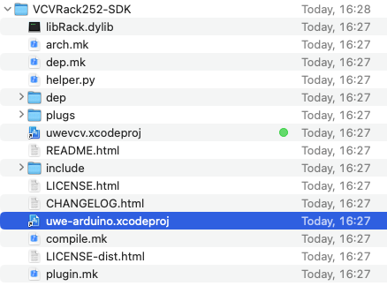
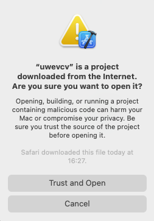
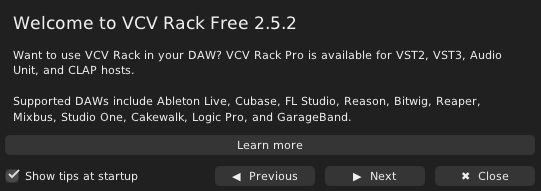
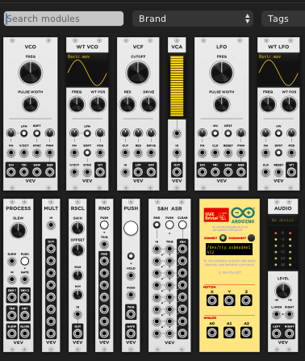
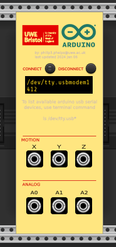
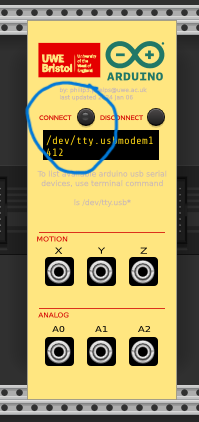
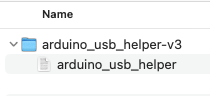
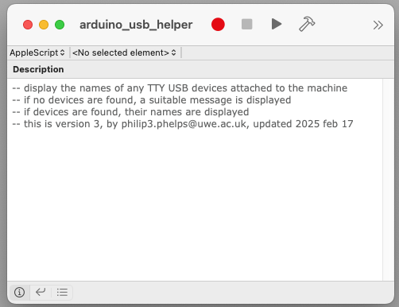

# Workshop 4 

In which we explore code for VCV Rack modules. To be updated.
# Workshop 4 

In which we explore code for VCV Rack modules. To be updated.

#Fun with Physical Computing, Interaction Design, and VCV Rack! 

Hello everyone! 

In this workshop we will be patching and controlling VCV Rack modules, however this time using tools and hardware that you have built with your hands. Using the components and tools that we provide, the controls for soft-synths are transported "off the screen and into the world"! (The workshop assumes you have _some_ familiarity with using VCV Rack, but please chat to us if you are unsure).

After some initial set up, you will be guided to explore the relationship between physical inputs and sound outputs, a core part of the music technology industry (and many others!) called Interaction Design.

# Getting Started

1. Download and open the supplied XCode project:  
.

2. When prompted, 'Trust and Open' the project:  
.

3. Use the XCode ‘Play’ button to build your project and await success. **VCV Rack will open automatically**  
  
  

# Moving into VCV Rack
1. Right Click in VCV Rack and open up the Modules Library:  

2. Check the UWE VCV Module is there (It's the bright yellow and red one with the UWE Logo at the top!)  

3. Open the VCV Rack Starter Patch we have provided. It's called 'VCV-starter.vcvrack. Once opened, it should look like this: <br.

# Setting up the Arduino
1. Look at the UWE Module. Press the CONNECT button on the UWE module **after** plugging in the Arduino.  

2. This might not work first time. If it doesn't connect, we have provided a tool to help find the USB name. The tool is called 'arduino_usb_helper' and will find the name of USB Devices attached to your machine.  

3. Similarly to XCode, you can run the tool we have created using the Play button.

