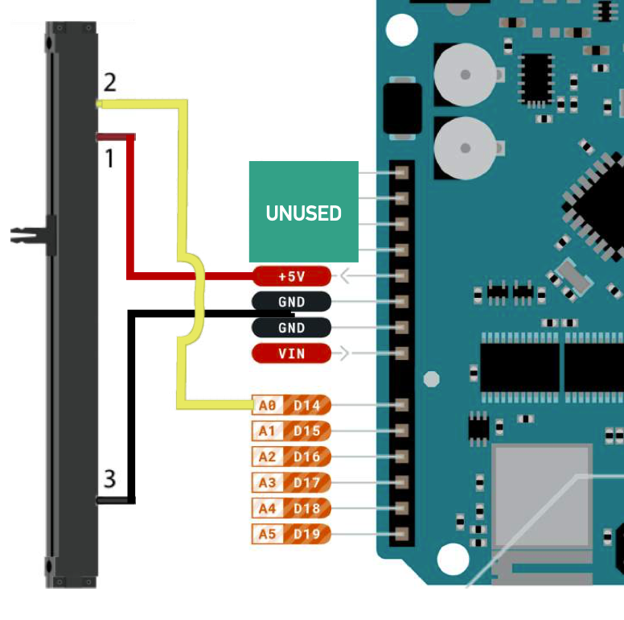

# Workshop 4 - Fun with Physical Computing, Interaction Design, and VCV Rack! 

   

Hello everyone! 

In this workshop we will be patching and controlling VCV Rack modules, however this time using tools and hardware that you have built with your hands. Using the components and tools that we provide, the controls for soft-synths are transported "off the screen and into the world"! (The workshop assumes you have _some_ familiarity with using VCV Rack, but please chat to us if you are unsure).

After some initial set up, you will be guided to explore the relationship between physical inputs and sound outputs, a core part of the music technology industry (and many others!) called Interaction Design.

# Part 1 - Getting Started

 
Click here for instructions!

## In this section, we will download all the files we need and build our VCV Rack project:
 
|Instructions                                                                                                    |Images                                                                                                                             |  
| :--------------------------------------------------------------------------------------------------------------| :-------------------------------------------------------------------------------------------------------------------------------: |
| 1. Download and open the supplied XCode project                                                                |                             |
| 2. When prompted, 'Trust and Open' the project                                                                 |                                                                    |
| 3. Use the XCode ‘Play’ button to build your project and await success. **VCV Rack will open automatically**   |        |
| 4. Open our template VCV Rack project which is included in your downloaded files|                                                    |

# Part 2 - Moving into VCV Rack

 
Click here for instructions!

 ## In this section, we will open up VCV Rack and make sure our custom UWE VCV Rack Module is installed:
 
| Instructions                                                                                                                          | Images                                      |
| :------------------------------------------------------------------------------------------------------------------------------------ | :-----------------------------------------: |
| 1. Right Click in VCV Rack and open up the Modules Library                                                                            |         |
| 2. Check the UWE VCV Module is there (It is the bright yellow and red one with the UWE Logo at the top!)                               |       |
| 3. Open the VCV Rack Starter Patch we have provided. It's called 'VCV-starter.vcvrack. Once opened, it should look like this:         |  |

# Part 3 - Setting up the Arduino

 
Click here for instructions!

## **Make sure to pay extra attention to detail in this section!** Here, we will set up our Arduino to work with VCV Rack and our UWE VCV Rack Module:
 
| Instructions                                                                                                                                                                                                         | Images                                        |
| :--------------------------------------------------------------------------------------------------------------------------------------------------------------------------------------------------------------------| :-------------------------------------------: |
| 1. Look at the UWE Module in VCV Rack. Press the CONNECT button on the UWE module **after** plugging in the Arduino.                                                                                                 |           |
| 2. This might not work first time. If it doesn't connect, we have provided a tool to help find the USB name. The tool is called 'arduino_usb_helper' and will find the name of USB Devices attached to your machine. |  |
| 3. Similarly to XCode, you can run the tool we have created using the Play button:                                                                                                                                   |     |
| 4. If your Arduino is not connected correctly, you will see this message. Check the device is correctly connected or speak to a member of staff:                                                                     |       |
| 5. If your Arduino is connected correctly, you will see this message. Copy the numbers and return to the UWE VCV Rack Module:                                                                                        |             |
| 6. Change the text in the UWE VCV Module to match the numbers you have copied and try to connect again.                                                                                                              |                                               |

# Part 4 - Setup finished... let's make some noise!

 
Click here for instructions!

 In this part of the workshop, we will focus on developing meaningful and intuitive relationships between physical inputs and sound outputs. The Arduino hardware we are using has a built-in gyroscopic sensor and is ready to go!

## Exercise 1 - Playful Exploration

First things first, let's figure out what our Arduino can do...

|What happens when you pick up the hardware and move it around gently? The motion outputs on our module should respond to **three** axis of movement... |                                                             |  
| :--------------------------------------------------------------------------------------------------------------| :-------------------------------------------------------------------------------------------------------------------------------: |

* What happens when you tilt the Arduino in different directions? 

* Can you work out which physical movements refer to which axis (x, y, z)? Hint: try a back-and-forth action, followed by up-and-down action, and then a side-to-side action 

* Can you work out how to tune the frequency to play a little melody? 

## Exercise 2 - Thinking about Interaction Design
When we discuss how people use things (everything from doors, fridges and cars to synthesisers, software and instruments!) we call this **Interaction Design**; how do we design the way we interact with stuff to make the best experience possible? We often take this for granted, but imagine playing a drumkit using a slider, or a guitar using 144 different buttons for each fretted note... some designs **FEEL** better than others...

|[Here are some examples of terribly designed volume controls...](https://uxdesign.cc/the-worst-volume-control-ui-in-the-world-60713dc86950) |                                                             |  
| :--------------------------------------------------------------------------------------------------------------| :-------------------------------------------------------------------------------------------------------------------------------: |

* Which motion feels **more intuitive** for pitch control – up-and-down or side-to-side? Why do you think this is?

* What sound parameters beyond oscillator pitch could we alter? Filter resonance? Filter cutoff? The speed of an LFO?

* What sound parameters feel intuitive or natural to control with a key-turning motion? Why do you think this is?

While there is no 'right or wrong' control for which type of interaction to use, some interaction styles may feel more intuitive or 'better' than others to you. Creative tools and Digital Musical Interfaces that are frustrating or confusing to interact with are arguably badly designed and difficult to work with. Of course, intentionally unpleasant experiences are just as valid as pleasant ones, but let’s try to have fun! 😀 

## Exercise 3 - Sliders
Let's start to add some new components... A very common Music Technology control mechanism is the **Slider**. These are great for controlling sound with “set and forget” behaviour; you move the slider to a value (set) and then leave it until you want to change it again (forget). They are also useful for reacting to expressive and articulate movements, such as swells, fades, risers or pushes.

|Here is how the slider (left of the image) connects to the Ardunio (right of the image):   We use three cables to do attach to three slots: 1. Power (Red) 2. Data (Yellow)  3. Ground (Black)  -Connect the Red Cable from Position 1 on the slider to the 5V slot  -Connect the Yellow Cable from Position 2 on the slider to the A0 slot.   -Connect the Black Cable from Position 3 on the slider to a GND slot   ||                                   
| :--------------------------------------------------------------------------------------------------------------| :-------------------------------------------------------------------------------------------------------------------------------: |

* Which audio parameters feel **more intuitive** to control using a slider? Why do you think this is?

## Exercise 4 - Distance Sensors
Okay, now for something different! Rather than moving the hardware around or moving a slider around, let's move ourselves around!

Let’s now connect a sensor to detect the motion of our hands in proximity to the sensor:

|Pick the sensor out and take a closer look...|                                                             |  
| :--------------------------------------------------------------------------------------------------------------| :-------------------------------------------------------------------------------------------------------------------------------: |

So how does it work? It emits a beam of infrared light whilst measuring the intensity of light bounced back into the photosensor. If you stare at the sensor (when it’s on), you can see a faint gloaw as some of the emitted light falls into the visible-light spectrum. 

Some sensors have a cable connected with red (POWER), black (GROUND) and yellow (SIGNAL) connectors. Some sensors have red (POWER), black (GROUND) and white (SIGNAL) connectors. 

Connect the sensor in place of the slider and observe the value as you move your hand over the sensor. Because the sensor detects the intensity of its reflected IR light, the sensor outputs near-zero when nothing is in front of it (approx. > 3ft), and ramps up as an object comes near, when the object is very close the value starts to drop off again. 

## Exercise 5 - Lights
Let’s build a Light Dependent Resistor circuit on the breadboard to use with your smartphone flashlight 😀🔦💡 

